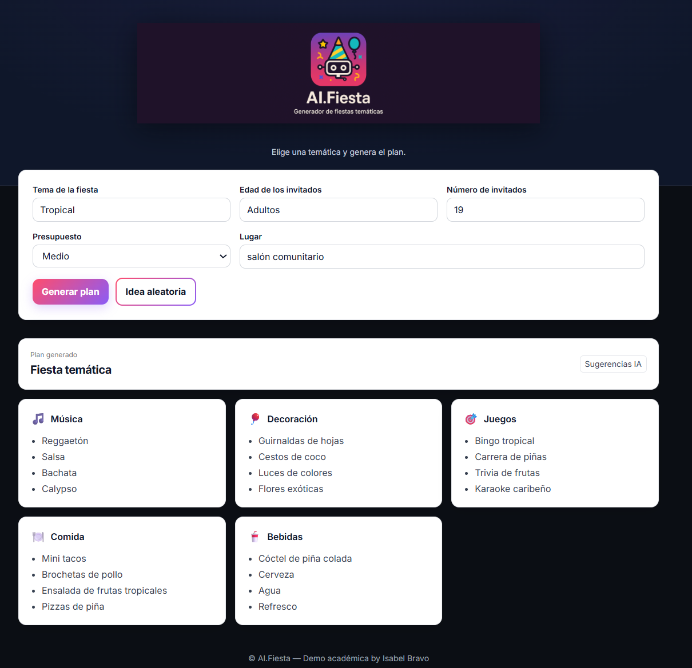

 

AI.Fiesta es una aplicación interactiva que te da ideas a la hora de organizar **fiestas temáticas personalizadas** con ayuda de una **IA generativa**.  
A partir de datos como el tema de la fiesta, edad y número de invitados, presupuesto y lugar, la IA genera un **plan completo** con música, decoración, juegos, comida y bebida.  

Combina un **backend en Flask**, conexión con **Groq LLM** y **PostgreSQL en AWS**, junto con un **frontend amigable en HTML/CSS**. Finalmente, el proyecto se despliega mediante **Docker**.  

---

## ¿Qué puedes hacer con AI.Fiesta?  

✅ Crear planes completos de fiestas temáticas con ayuda un asistente IA.  
✅ Generar ideas aleatorias con un solo clic.  
✅ Guardar automáticamente las consultas en una **base de datos en AWS (PostgreSQL)**.  
✅ Consultar y visualizar los resultados desde el **frontend web** en forma de tarjetas.  

---

## Tecnologías utilizadas  

- ✅ **Python 3.10+**  
- ✅ **Flask** — Backend API  
- ✅ **Groq + GPT (openai/oss-20b)** — LLM para la generación de fiestas  
- ✅ **PostgreSQL (AWS Aurora & RDS + pgAdmin4)** — Base de datos en la nube  
- ✅ **HTML, CSS, JavaScript** — Frontend interactivo  
- ✅ **Docker** — Despliegue y portabilidad  

---

## Estructura del proyecto  

AI.Fiesta/
│
├── app/ # Archivo principal Flask (API)
│ └── app.py
│
├── frontend/ # Interfaz web (HTML, CSS, JS)
│ └── index.html
│
├── funciones/ # Funciones de conexión con LLM y BBDD
│ └── ...
│
├── variables/ # Variables globales del proyecto
│ └── ...
│
├── test/ # Pruebas unitarias con pytest
│ └── test.py
│
├── imagenes/ # Imágenes y logos
│ └── logo.png
│
├── Dockerfile # Configuración para contenedor Docker
├── requirements.txt # Dependencias del proyecto
├── .env (local) # Variables sensibles
└── README.md # Este archivo

## Posibles mejoras futuras

✅ Un frontend más atractivo.

✅ Añadir enlaces a playlists musicales.

✅ Incluir moodboards de decoración.

✅ Recomendación de juegos online.

✅ Añadir enlaces a recetas de comida y bebidas.

✅ Ampliar la base de datos y dividir sugerencias por tablas.

✅ Mejorar el prompt y usar modelos más potentes.

